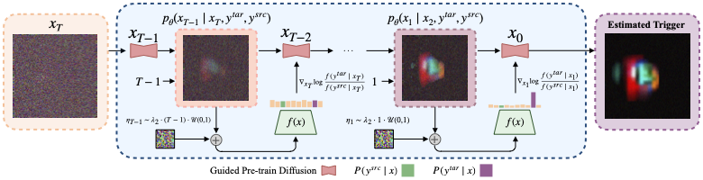

# Data-Free Inversion of Suspicious Trojan Inputs via Latent Diffusion

DISTIL is an innovative trigger-inversion method for deep neural networks that reconstructs malicious backdoor triggers without relying on extensive datasets or strong assumptions about trigger appearance. By employing a diffusion-based generator guided by the target classifier, DISTIL iteratively produces candidate triggers that align with the model's internal representations associated with malicious behavior. This approach effectively narrows the search space and enhances the reliability of trigger reconstruction, making it capable of distinguishing between clean and trojaned models. Empirical evaluations demonstrate that DISTIL significantly outperforms existing methods, achieving notable improvements in accuracy on benchmark datasets, thereby providing a robust and adaptable defense against backdoor attacks.

🚀 Accepted to **ICCV 2025**! 

<p align="center">

</p>

# Demos

- [backdoor_detector_TrojAI_Round1.ipynb](./backdoor_detector_TrojAI_Round1.ipynb)  
- [backdoor_detector_objDetection.ipynb](./backdoor_detector_objDetection.ipynb)  
- [mitigation_task.ipynb](./mitigation_task.ipynb)  
- [target_class_prediction_task.ipynb](./target_class_prediction_task.ipynb)


# Citation 
Please cite our work if you use the codebase: 
```
Hossein Mirzaei, Zeinab Sadat Taghavi, Sepehr Rezaee, Masoud Hadi, Moein Madadi, Mackenzie W Mathis
DISTIL: Data-Free Inversion of Suspicious Trojan Inputs via Latent Diffusion
ICCV 2025
```
